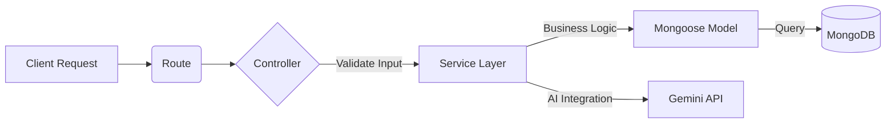

# 🚀 Enterprise Task Management System (TaskFlow)


> **Hệ thống quản lý công việc bảo mật cao, tích hợp AI Agent, thiết kế theo kiến trúc Layered Architecture.**

---

## 📖 Mục lục
1. [Giới thiệu & Vấn đề](#-giới-thiệu--vấn-đề)
2. [Kiến trúc hệ thống](#-kiến-trúc-hệ-thống)
3. [Tính năng nổi bật (Key Highlights)](#-tính-năng-nổi-bật)
4. [Cài đặt & Chạy thử](#-cài-đặt--chạy-thử-trong-1-phút)
5. [Tài liệu API](#-tài-liệu-api)

---

## 💡 Giới thiệu & Vấn đề

Khi xây dựng các ứng dụng quản lý doanh nghiệp, các giải pháp "Todo App" cơ bản thường gặp phải các vấn đề:
1.  **Code Spaghetti:** Logic nằm lộn xộn trong Controller, khó bảo trì khi mở rộng.
2.  **Bảo mật kém:** Lưu Token ở LocalStorage (dễ bị XSS), không có Rate Limit.
3.  **Thiếu tính tương tác:** Chỉ là CRUD đơn thuần, không có AI hỗ trợ.

**👉 Giải pháp của tôi:** TaskFlow được xây dựng để chứng minh năng lực **Backend Engineering** với cấu trúc 3 tầng (3-Layer), bảo mật đa lớp và tích hợp Gemini AI để thực hiện Function Calling.

---

## 🏗 Kiến trúc hệ thống

Dự án áp dụng triệt để mô hình **Separation of Concerns**:



*   **Controller:** "Skinny". Chỉ tiếp nhận request, gọi Service và trả response.
*   **Service:** "Fat". Chứa toàn bộ Business Logic (VD: Logic giao việc, check quyền Team Lead).
*   **DTO (Data Transfer Object):** Filter dữ liệu đầu vào/ra, đảm bảo không lộ field nhạy cảm (như `passwordHash`).

---

## 🔥 Tính năng nổi bật

### 1. 🔐 Enterprise Security (Ưu tiên hàng đầu)
*   **JWT Rotation:** Access Token (15p) + Refresh Token (7 ngày).
*   **HttpOnly Cookie:** Chống XSS, Refresh Token được lưu và rotation trong Cookie bảo mật.
*   **Rate Limiting:** Chống Spam/DDoS (Giới hạn 100 req/15p).
*   **Helmet:** Bảo vệ HTTP Headers.

### 2. 🤖 AI Agent (Gemini Function Calling)
Không chỉ là Chatbot, AI trong hệ thống này đóng vai trò là một **Agent**:
*   Hiểu ngôn ngữ tự nhiên: *"Tạo task họp team lúc 2h chiều mai"*.
*   **Function Calling:** AI tự động trích xuất dữ liệu và gọi hàm `createTask` hoặc `getMyTasks` trong Service để thực thi hành động thật.

### 3. 👥 Team Collaboration & RBAC
*   **Role-Based Access Control:** Admin, Team Lead, Member, Viewer.
*   **Logic nghiệp vụ:** Member không thể xem task của team khác, chỉ Team Lead mới được xóa thành viên.

---

## ⚡ Cài đặt & Chạy thử (Trong 1 phút)

Yêu cầu: Node.js, MongoDB (Local hoặc Atlas URL).

### Bước 1: Clone & Setup
```bash
git clone https://github.com/your-username/enterprise-task-manager.git
cd enterprise-task-manager

# Cài đặt dependency cho cả Server và Client (chạy 1 lệnh duy nhất)
npm run install-all
```

### Bước 2: Cấu hình môi trường
Tạo file `server/.env`:
```env
PORT=5000
MONGO_URI=mongodb://localhost:27017/enterprise_task_db
JWT_SECRET=complex_secret_key
JWT_REFRESH_SECRET=complex_refresh_secret
CLIENT_URL=http://localhost:5173
API_KEY=your_google_gemini_api_key
```

### Bước 3: Seed Data (Tạo Admin mặc định)
```bash
npm run seed
# Admin mặc định: admin@taskflow.com / Admin@123456
```

### Bước 4: Chạy dự án
```bash
# Chạy song song cả Backend và Frontend
npm run dev
```
*   Server: http://localhost:5000
*   Client: http://localhost:5173

---

## 📚 Tài liệu API

Dự án tích hợp sẵn **Swagger/OpenAPI**.
Sau khi chạy server, truy cập: **[http://localhost:5000/api-docs](http://localhost:5000/api-docs)**

---

## 👨‍💻 Tech Stack

*   **Backend:** Node.js, Express, MongoDB, Redis (Planned), Gemini AI SDK.
*   **Frontend:** React 18, Vite, Ant Design, TailwindCSS, Zustand.
*   **Tools:** Docker, Swagger, Eslint.

---
*Project developed by **Phan Đình Tuân**.*
---

## 📬 Liên hệ

-   Email: tuanktvn2001@gmail.com
-   Github: 
-   LinkedIn: 

---
