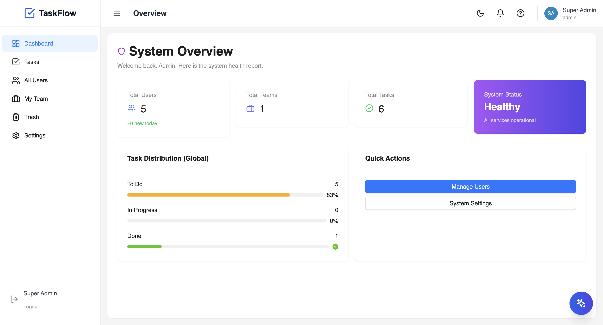
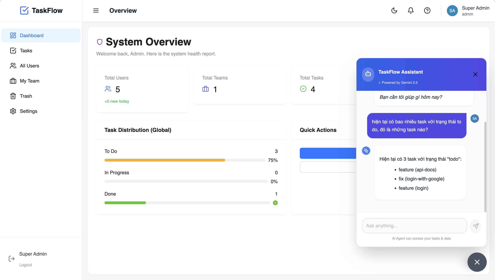
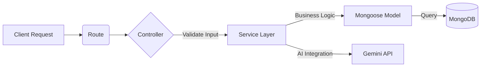

# 🚀 Enterprise Task Management System (TaskFlow)


> **Hệ thống Quản lý Công việc Doanh nghiệp bảo mật cao, tích hợp AI Agent, và tuân thủ Kiến trúc Phân lớp (Layered Architecture).**
> *Dự án được xây dựng để demonstrate năng lực Engineering chuyên sâu về Backend, Bảo mật, và System Design.*

---

## 📸 Demo & Highlights
LINK DEMO: [https://task-flow-enterprise-task-managemen.vercel.app](https://task-flow-enterprise-task-managemen.vercel.app)


### 🎥 Live Demo:


*(Giao diện Dashboard trực quan và thao tác mượt mà)*

---

## 📖 Mục lục
1. [Vấn đề & Giải pháp](#-vấn-đề--giải-pháp)
2. [Sức mạnh của AI Agent](#-sức-mạnh-của-ai-agent-vũ-khí-bí-mật) 🤖 
3. [Công nghệ sử dụng (Tech Stack)](#-công-nghệ-sử-dụng-tech-stack) 🛠 
4. [Kiến trúc Hệ thống](#-kiến-trúc-hệ-thống)
5. [Điểm nhấn Kỹ thuật](#-điểm-nhấn-kỹ-thuật)
6. [Hướng dẫn Cài đặt](#-hướng-dẫn-cài-đặt)
7. [Liên hệ](#-liên-hệ) 📬 

---

## 💡 Vấn đề & Giải pháp

Các ứng dụng TODO cơ bản thường gặp phải những **anti-patterns** nghiêm trọng khi mở rộng cho doanh nghiệp:
1.  **"Spaghetti Code":** Logic nghiệp vụ trộn lẫn trong Controller.
2.  **Bảo mật yếu:** Lưu Token ở LocalStorage (dễ bị XSS), thiếu cơ chế Refresh Token an toàn.
3.  **Hard-coded Authorization:** Chỉ check `if (role === 'admin')` thay vì cơ chế phân quyền động.

**👉 Giải pháp TaskFlow:**
Tôi xây dựng TaskFlow với tư duy **"Security First"** và **"Clean Architecture"**, đảm bảo code dễ bảo trì, dễ test và an toàn tuyệt đối.

---

## 🤖 Sức mạnh của AI Agent



TaskFlow không sử dụng chatbot thông thường. Tôi đã tích hợp **Gemini Pro** để biến AI thành một **Agent** có khả năng tương tác sâu với hệ thống:

### 1. Natural Language Processing (NLP) to Action
Người dùng có thể ra lệnh bằng ngôn ngữ tự nhiên, AI sẽ phân tích và thực thi hành động tương ứng.
*   🗣️ **User:** *"Tạo task hoàn thành chức năng login và register với hạn deadline là cuối tuần này"*
*   ⚙️ **System:** Tự động trích xuất `title`, `deadline`, `priority` và gọi API `createTask`.

### 2. Context-Aware Assistance
AI hiểu ngữ cảnh của dự án và dữ liệu hiện tại.
*   🗣️ **User:** *"Tôi còn bao nhiêu task chưa làm?"*
*   ⚙️ **System:** AI gọi hàm `getTasks({ status: 'todo', dueDate: 'this_week' })` và tổng hợp báo cáo ngắn gọn.


---

## � Công nghệ sử dụng (Tech Stack)

### Backend (Core)
*   **Node.js & Express**: Xây dựng RESTful API hiệu năng cao, xử lý Non-blocking I/O.
*   **MongoDB & Mongoose**: Database NoSQL linh hoạt, Modeling dữ liệu chặt chẽ.
*   **JWT (JSON Web Token)**: Cơ chế xác thực Stateless (Access + Refresh Token trong HttpOnly Cookie).
*   **Google Generative AI SDK**: Tích hợp Large Language Model (Gemini Pro).
*   **Helmet & Cors**: Bảo mật HTTP Headers và config Cross-Origin.

### Frontend (Client)
*   **React 18 (Vite)**: Framework UI hiện đại, tốc độ build siêu nhanh.
*   **Ant Design 5.0**: Hệ thống Design System chuẩn doanh nghiệp, giao diện nhất quán.
*   **TailwindCSS**: Utility-first CSS framework giúp styling nhanh chóng.
*   **Zustand**: Quản lý State đơn giản, nhẹ và hiệu quả (thay thế Redux).
*   **Axios**: HTTP Client với Interceptors (xử lý auto-refresh token).


---

## 🏗 Kiến trúc Hệ thống

Dự án áp dụng mô hình **3-Layer Architecture** tách biệt hoàn toàn trách nhiệm:



*   **Controller Layer:** "Skinny". Chỉ tiếp nhận request và gọi Service.
*   **Service Layer:** "Fat". Chứa toàn bộ logic nghiệp vụ (Business Rules).
*   **Model Layer:** Tương tác database.

---

## 🔥 Điểm nhấn Kỹ thuật

1.  **Enterprise Security:** Cơ chế **JWT Rotation** (Refresh Token lưu HttpOnly Cookie) chống XSS và đánh cắp session.
2.  **Centralized Error Handling:** Xử lý lỗi tập trung, trả về format chuẩn cho mọi request.
3.  **Advanced Policy-Based Authorization (ABAC):**
    *   Thay vì hard-code check quyền trong Controller (Anti-pattern), tôi tách biệt logic này vào thư mục `server/src/policies`.
    *   **Cơ chế:** Kiểm tra quyền dựa trên thuộc tính (Attribute) của User và Resource.
        *   *Ví dụ:* `TaskPolicy.canDelete(user, task)` -> Logic: "Admin được xóa mọi lúc. User thường chỉ được xóa task do mình tạo nếu task đó chưa hoàn thành."
    *   **Lợi ích:** Dễ dàng Unit Test độc lập các logic phân quyền phức tạp này.

---

## ⚡ Hướng dẫn Cài đặt

### Yêu cầu
*   Node.js v14+
*   MongoDB URI

### 1. Setup Backend
```bash
cd server
npm install
# Tạo file .env theo mẫu
npm run seed # Tạo Admin: admin@taskflow.com / Admin@123456
npm run dev
```
> Server: `http://localhost:3000`

### 2. Setup Frontend
```bash
cd client
npm install
npm run dev
```
> Client: `http://localhost:5173`

---

## 📬 Liên hệ

Dự án được phát triển và duy trì bởi:

*   **Phan Đình Tuân** - *Backend Developer*
*   📧 Email: [tuanktvn2001@gmail.com](mailto:tuanktvn2001@gmail.com)
*   🐙 Github: [github.com/nameTun](https://github.com/nameTun)
*   💼 LinkedIn: [linkedin.com/in/phan-dinh-tuan](https://www.linkedin.com/in/phan-dinh-tuan)
---
*Cảm ơn đã quan tâm đến dự án TaskFlow!* 🚀
